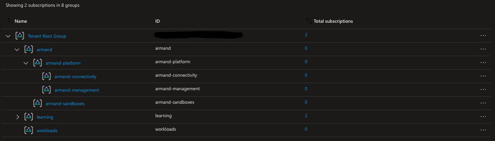

# Management Groups
## Overview
The [bicep](https://docs.microsoft.com/en-us/azure/azure-resource-manager/bicep/overview?tabs=bicep) template in this directory can be used to load a management group structure from an external data file and create management groups then move any child management groups to their desired parent.

This is useful when one needs to deploy an enterprise-level management group structure, especially when consistency is required across multiple tenants.

`PREFIX` is used in `managementGroups.json` in the root directory of this project, and is used in `main.bicep` to control prefixing management group names. This is especially useful when you need to differentiate between your tenants (e.g. unclassified and classified) while maintaining consistency.
See [Azure Landing Zones by John Blevins from Microsoft](https://github.com/johnsblevins/AzureLandingZones) for more on this concept and others.

Below is an example of what is deployed using `main.bicep` when the `prefix` parameter is specified as `armand`

</img>
## Usage
```bash
az deployment tenant create --name example --location eastus -f templates/mgs/main.bicep
```
